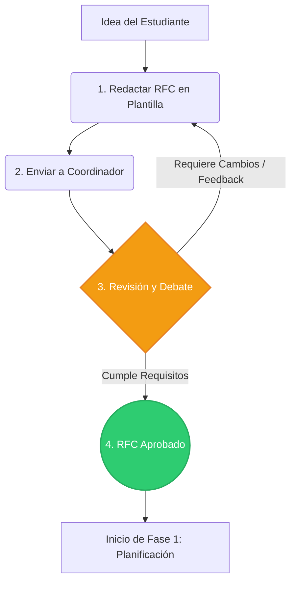

# Metodología de Trabajo

Esta es la metodología de trabajo utilizada en TODOS los proyectos de la Comunidad Linux y Open Source. Una metodología se define básicamente como una secuencia de pasos ordenados, desde la concepción de una idea hasta su despliegue final. Aplicar esto es estrictamente necesario en nuestros proyectos por tres motivos principales:

1. **Somos estudiantes:** El tiempo efectivo que podemos dedicar al desarrollo de proyectos es limitado. Una buena organización hace que nuestro trabajo sea eficiente, evita la frustración y asegura que las ideas no queden abandonadas a mitad de semestre.
2. **Es el estándar de la industria:** En el mundo profesional, todo desarrollo de software utiliza metodologías estructuradas. Al establecer y practicar nuestro propio flujo de trabajo, te estamos brindando herramientas de gestión y habilidades blandas indispensables para el campo laboral.

---

## Fase 0: Ideación

Todo gran proyecto de código abierto nace de una idea, pero las ideas sin estructura se desvanecen. Antes de crear repositorios o escribir la primera línea de código, el proyecto debe ser pensado y justificado. 

Para esto utilizamos un enfoque basado en **RFC (Request for Comments)**.

### Pasos de la Fase 0:

**1. Redacción de la Propuesta**  
Cualquier miembro con una idea (que asumirá el rol inicial de Jefe de Proyecto) debe rellenar la [**Plantilla RFC**](https://github.com/lyoss-usm/docs/blob/main/RFC.md) oficial de la comunidad. Este documento te obligará a definir el problema, delimitar el alcance mínimo viable (MVP) y esbozar la arquitectura técnica. 

**2. Envío de la Propuesta**  
El documento Markdown rellenado debe ser enviado al Coordinador de Proyectos en actividad, cuyo método de contacto lo puedes encontrar en nuestra [Página Web](https://lyoss.org/nosotros).

**3. Revisión, Debate y Feedback**  
Los coordinadores y otros miembros leerán el RFC. De haber consultas o preguntas, el Coordinador de Proyectos en actividad te contactará para poder solicitarte más información.

**4. Aprobación Oficial**  
Una vez que el proyecto tiene un alcance realista, aporta valor real y el diseño conceptual tiene sentido, la coordinación cambiará el estado del RFC a `Aprobado`. 

---

## Fase 1: Planificación y Configuración Inicial

Una vez que el RFC ha sido `Aprobado`, el Jefe de Proyecto asume la responsabilidad de liderar. Un líder no solo programa, sino que prepara el terreno para que otros puedan aportar.

### Pasos de la Fase 1:

**1. Configuración del Repositorio**  
El repositorio debe ser acogedor. Alguien que no conoce el proyecto debería poder entenderlo en 5 minutos. Debes inicializar lo siguiente, como minimo:
* **Archivo README.md:** Descripción del proyecto, requisitos, y cómo ejecutarlo localmente.
* **Archivo CONTRIBUTING.md:** Una guía rápida de cómo otros estudiantes pueden aportar (dónde encontrar issues, con quién hablar).
* **El Documento RFC:** Subir el archivo Markdown del RFC a `/docs` o la raíz, para que el historial de decisiones esté siempre visible.
* **Estructura Base:** Crear las carpetas iniciales (`/src`, `/docs`, etc.).

**2. Desglose y Creación de Issues**  
El Jefe de Proyecto es el encargado de crear los *Issues* (tareas atómicas). Utilizamos una **Plantilla de Issue** ya predefinida en GitHub:
* **Historia de Usuario:** "*Como [Usuario] Quiero [Lograr algo] Para [Obtener un beneficio]*".
* **Criterios de Aceptación:** Checklist con las condiciones exactas para terminar la tarea.
* **Tareas de Desarrollo:** Lista técnica de pasos a implementar.

**3. Búsqueda Activa de Colaboradores**  
Si bien la comunidad de Lyoss USM hace llamados generales para participar, **es vital que el Jefe de Proyecto busque activamente talento**. No esperes a que la gente adivine que tu proyecto existe. Promociona tus Issues en los grupos, invita directamente a compañeros a resolver tareas pequeñas y sé un mentor. La comunidad te dará todas las plataformas, pero la motivación del equipo depende de ti. ([Guía: Cómo encontrar usuarios y colaboradores](https://opensource.guide/es/finding-users/)).

**4. Uso de Etiquetas**  
Cada Issue debe ser categorizado para organizar el tablero y el Changelog:
* `Funcionalidad`: Nuevas características.
* `Fix`: Solución a un bug.
* `Test`: Pruebas.
* `Docs`: Cambios de documentación.
* `Oculto`: Etiqueta especial para evitar que el Issue aparezca en el Changelog final al usar "Squash and Merge".
* `Good First Issue`: Úsala para tareas muy sencillas. Es para committers con poca o nada de experiencia.

**5. Asignación y Tablero (Metodologia Kanban)**  
Para evitar reuniones largas y aburridas, foomentamos el hecho de que cada colaborador se autoasigne una tarea segun su disposiicioón de tiempo y conocimiento. El flujo del tablero es:
* **To Do:** Issues listos para ser tomados.
* **In Progress:** Alguien ya está trabajando en esto.
* **In Review:** Esperando revisión (PR abierto).
* **Done:** Tarea finalizada e integrada.

---

## Fase 2: Flujo de Desarrollo

Utilizamos un modelo basado en ramas y [**Conventional Commits**](https://www.conventionalcommits.org/es/v1.0.0/) para evitar conflictos y mantener un historial profesional.

### Pasos de la Fase 2:

**1. Ramas Principales**  
**Jamás debes hacer un *push* directo a estas ramas protegidas:**
* **`main`**: Código en producción, versión estable.
* **`dev`**: Rama de integración donde aterrizan las nuevas características.

**2. Creación de la Rama de Trabajo**  
Crea tu rama local siempre desde `dev`. Usa nombres descriptivos en minúsculas y con guiones:
* `feature/nombre-corto`
* `fix/nombre-error`
* `docs/nombre-documento`

**3. Commits Semánticos**  
En nuestra comunidad usamos el estándar de [**Commits Convencionales (Semantic Commits)**](https://www.conventionalcommits.org/es/v1.0.0/). El mensaje debe ser corto, al grano y explicar la naturaleza del cambio:
* `feat: agrega buscador de salas`
* `fix: corrige validación de login`
* `docs: actualiza README`
* `style: formatea código`

---

## Fase 3: Revisión e Integración (Pull Requests)

### Pasos de la Fase 3:

**1. Apertura del Pull Request (PR)**  
Abre un PR apuntando siempre a la rama `dev`.

**2. Rellenar la Plantilla Automática**  
Completa la plantilla de PR obligatoria de GitHub. Para cerrar el Issue automáticamente al aprobar el PR, usa palabras clave como `Closes #15`.

**3. Revisión de Código (Code Review)**  
**Nadie aprueba su propio código.** Espera a que un *Maintainer* o el *Jefe de Proyecto* lo revise. Si hay correcciones, haz nuevos commits en tu rama. Si todo está bien, se aprueba y se hace *merge* a `dev`.

---

## Fase 4: Producción y Releases

### Pasos de la Fase 4 (Exclusivo para Jefes de Proyecto):

**1. Preparación de la Release**  
Crea un PR desde `dev` apuntando a `main`.

**2. Integración mediante Squash and Merge**  
Al aprobar, utiliza **exclusivamente** la opción **Squash and Merge**. Esto comprime todos los commits de desarrollo en uno solo, manteniendo un historial limpio, permitiendo revertir errores y generando un Changelog profesional.

---

## 📚 Recursos y Lecturas para Jefes de Proyecto

Liderar un proyecto de software libre va mucho más allá del código. Te recomendamos encarecidamente revisar estas guías para formar una comunidad sana y un proyecto exitoso:

* [**The Apache Way**](https://theapacheway.com/): Entiende la filosofía de "Comunidad sobre Código" y cómo se logran los consensos.
* [**Iniciando un Proyecto Open Source**](https://opensource.guide/es/starting-a-project/): Cómo preparar tu repositorio antes de invitar a otros.
* [**Liderazgo y Gobernanza**](https://opensource.guide/es/leadership-and-governance/): Cómo tomar decisiones difíciles cuando el equipo no se pone de acuerdo.
* [**Construyendo Comunidades Acogedoras**](https://opensource.guide/es/best-practices/): Mejores prácticas para que los colaboradores no se vayan.
* [**Seguridad en Proyectos**](https://opensource.guide/es/security-best-practices-for-your-project/): Cómo evitar que datos sensibles terminen expuestos en el repositorio.
