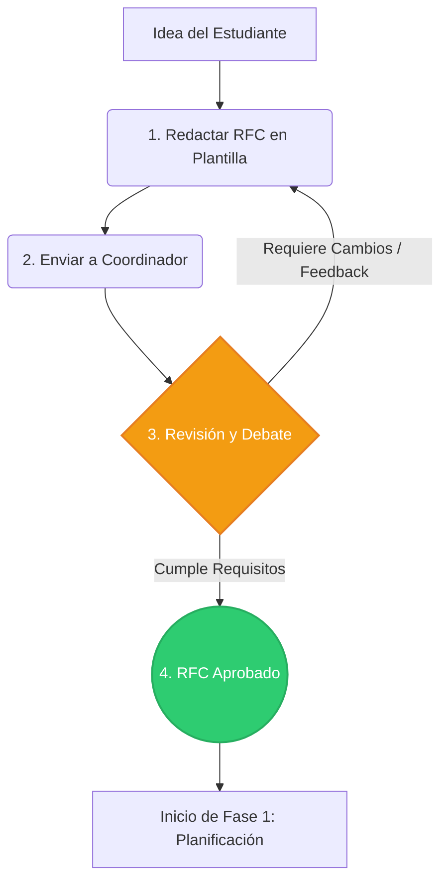

# Metodología de Trabajo

Esta es la metodología de trabajo utilizada en TODOS los proyectos de la Comunidad Linux y Open Source. Una metodología se define básicamente como una secuencia de pasos ordenados, desde la concepción de una idea hasta su despliegue final. Aplicar esto es estrictamente necesario en nuestros proyectos por dos motivos principales:

1. **Somos estudiantes:** El tiempo efectivo que podemos dedicar al desarrollo de proyectos es limitado. Una buena organización hace que nuestro trabajo sea eficiente, evita la frustración y asegura que las ideas no queden abandonadas a mitad de semestre.
2. **Es el estándar de la industria:** En el mundo profesional, todo desarrollo de software utiliza metodologías estructuradas. Al establecer y practicar nuestro propio flujo de trabajo, te estamos brindando herramientas de gestión y habilidades blandas que son indispensables para el campo laboral.

---

## Fase 0: Ideación

Todo gran proyecto de código abierto nace de una idea, pero las ideas sin estructura se desvanecen. Antes de crear repositorios o escribir la primera línea de código, el proyecto debe ser pensado y justificado. 

Para esto utilizamos un enfoque basado en **RFC (Request for Comments)**, un estándar en el mundo Open Source.

### Pasos de la Fase 0:

**1. Redacción de la Propuesta**
Cualquier miembro con una idea (que asumirá el rol inicial de Jefe de Proyecto) debe rellenar la [**Plantilla RFC**](https://github.com/lyoss-usm/docs/blob/main/RFC.md) oficial de la comunidad. Este documento te obligará a definir el problema, delimitar el alcance mínimo viable (MVP) y esbozar la arquitectura técnica. 

**2. Envío de la Propuesta**
El documento Markdown rellenado debe ser enviado al Coordinador de Proyectos en actividad, cuyo método de contacto lo puedes encontrar en nuestra [Página Web](https://lyoss.org).

**3. Revisión, Debate y Feedback**
Los coordinadores y otros miembros leerán el RFC. De haber consultas o preguntas, el Coordinador de Proyectos en actividad te contactará para poder solicitarte más información.

**4. Aprobación Oficial**
Una vez que el proyecto tiene un alcance realista, aporta valor real y el diseño conceptual tiene sentido, la coordinación cambiará el estado del RFC a `Aprobado`. 

---

## Fase 1: Planificación y Configuración Inicial

Una vez que el RFC ha sido `Aprobado`, el Jefe de Proyecto es el responsable de preparar el repositorio para que cualquier voluntario o colaborador pueda llegar, entender qué hay que hacer, y ponerse a programar sin barreras.

### Pasos de la Fase 1:

**1. Configuración del Repositorio**
El Jefe de Proyecto debe inicializar el repositorio oficial. Esto incluye, como mínimo:
* **Archivo README.md:** Una descripción clara del proyecto, requisitos técnicos, más una sección de cómo descargarlo, compilarlo y ejecutarlo en local.
* **El Documento RFC:** Subir el archivo Markdown del RFC aprobado a una carpeta `/docs` o en la raíz, para que el historial de decisiones y el MVP estén siempre visibles.
* **Estructura Base:** Crear la estructura de carpetas inicial (ej: `/src`, `/docs`, etc.) según el stack elegido.

**2. Desglose y Creación de Issues**
El Jefe de Proyecto es el encargado de crear los *Issues*, que son las tareas atómicas a realizarse. Para mantener el estándar de calidad, utilizamos una **Plantilla de Issue** predefinida en GitHub que exige la siguiente estructura:
* **Historia de Usuario:** Escrita en formato "*Como [Usuario] Quiero [Lograr algo] Para [Obtener un beneficio]*".
* **Criterios de Aceptación:** Un checklist claro con las condiciones exactas que deben cumplirse para considerar la tarea como terminada.
* **Tareas de Desarrollo:** Lista técnica de pasos a implementar.
* **Notas Adicionales:** Contexto extra o referencias.

**3. Uso de Etiquetas (Labels)**
Cada Issue debe ser categorizado. Esto es vital para la organización visual y para la generación automática de los reportes de cambios (Changelog). Las etiquetas principales son:
* `Funcionalidad`: Nuevas características (Historias de Usuario).
* `Fix`: Solución a un error o bug existente.
* `Test`: Pruebas de funcionamiento.
* `Docs`: Cambios exclusivos de documentación.
* `Oculto`: **Etiqueta especial.** Dado que en nuestra metodología de Git utilizamos "Squash and Merge" para integrar código, esta etiqueta le indica al sistema que **no incluya** este Issue en el Changelog oficial al pasar a producción (ideal para cambios internos muy menores que no aportan valor visible al usuario final).

**4. Asignación de Tareas (Auto-asignación)**
Fomentamos la proactividad. Si un Issue está libre, **el colaborador simplemente se lo auto-asigna** usando la función `Assignees` de GitHub. No necesitas pedir permiso; si nadie está trabajando en ello, la tarea es tuya.

**5. Organización del Tablero (Kanban)**
Todos los Issues generados deben organizarse visualmente en el tablero de GitHub Projects. Es vital que quien esté realizando la tarea actualice su estado. El flujo básico es:
* **To Do (Por hacer):** Issues listos para ser tomados (sin asignar).
* **In Progress (En progreso):** Alguien ya se auto-asignó la tarea y está trabajando en ella.
* **In Review (En revisión):** El código ya se hizo y está esperando ser revisado mediante un Pull Request.
* **Done (Completado):** Tarea finalizada, aprobada e integrada al proyecto principal.

---

## Fase 2: Flujo de Desarrollo

Una vez que tienes tu Issue asignado y lo moviste a "In Progress" en el tablero, es hora de escribir código. Para mantener nuestro repositorio ordenado y evitar conflictos cuando varias personas programan al mismo tiempo, utilizamos un modelo basado en ramas y *Conventional Commits*.

### Pasos de la Fase 2:

**1. Ramas Principales**
Nuestro repositorio tiene dos ramas base. **Jamás debes hacer un *push* directo a ellas**, de hecho, están protegidas por reglas de sistema:
* **`main`**: Es el código en producción. Es la versión 100% estable, funcional y lista para el usuario.
* **`dev`**: Es la rama de integración y desarrollo continuo. Aquí aterrizan y se prueban todas las nuevas características antes de pasar a producción.

**2. Creación de la Rama de Trabajo**
Para empezar a trabajar en tu Issue, debes crear una rama temporal local partiendo siempre desde `dev`. El nombre de tu rama debe ser descriptivo, en minúsculas, usando guiones, y debe llevar un prefijo que indique el tipo de trabajo:
* `feature/nombre-corto-de-tarea` (para nuevas funcionalidades)
* `fix/nombre-del-error` (para solucionar bugs)
* `docs/nombre-del-documento` (para tareas de solo documentación)

**3. Historial Limpio (Commits Semánticos)**
A medida que avanzas, debes guardar tu trabajo con *commits*. En nuestra comunidad, los mensajes de los commits no pueden ser "cambios varios" o "ahora sí funciona". Usamos el estándar de **Commits Semánticos**:
El mensaje debe ser corto, al grano, y comenzar con un prefijo que explique la naturaleza del cambio:
* `feat: agrega buscador de salas por edificio`
* `fix: corrige validación de formulario de login`
* `docs: actualiza instrucciones de instalación en README`
* `style: formatea el código según el linter`

---

## Fase 3: Revisión e Integración (Pull Requests)

Una vez que has terminado de escribir tu código, has hecho tus commits y subido tu rama al repositorio remoto, es momento de integrar tu trabajo a la rama de desarrollo. 

### Pasos de la Fase 3:

**1. Apertura del Pull Request (PR)**
Debes abrir un Pull Request en GitHub. El PR **siempre debe apuntar hacia la rama `dev`** (nunca hacia `main`). Esta es la solicitud formal para que tu código sea revisado.

**2. Rellenar la Plantilla Automática**
Al crear el PR, GitHub cargará automáticamente nuestra **Plantilla de Pull Request**. Es obligatorio rellenarla con todo el contexto solicitado. 
* *Cierre automático:* En la descripción de tu PR, asegúrate de vincular el Issue original usando palabras clave de GitHub (por ejemplo, escribiendo `Closes #15` o `Fixes #22`). Así, cuando tu PR sea aprobado, el Issue se moverá automáticamente a "Done" en el tablero.

**3. Revisión de Código (Code Review)**
**Nadie puede aprobar su propio código.** Una vez abierto el PR, debes esperar a que un *Maintainer* o el *Jefe de Proyecto* lo revise. 
* Si hay correcciones necesarias, te dejarán comentarios y deberás hacer nuevos commits en tu misma rama para solucionarlos.
* Si todo está correcto, ellos aprobarán el PR y harán el *merge* del código hacia la rama `dev`.

---

## Fase 4: Producción y Releases

La rama `dev` irá acumulando las diferentes funcionalidades y correcciones que los voluntarios vayan completando. Cuando el Jefe de Proyecto considere que hay suficientes características terminadas para lanzar una nueva versión de la herramienta, se inicia la fase de producción.

### Pasos de la Fase 4 (Exclusivo para Jefes de Proyecto):

**1. Preparación de la Release**
El Jefe de Proyecto creará un Pull Request desde la rama `dev` apuntando hacia la rama `main`. Esta es la versión que llegará a los usuarios finales.

**2. Integración mediante Squash and Merge**
Al momento de aprobar e integrar este PR hacia `main`, el Jefe de Proyecto utilizará **exclusivamente** la opción **Squash and Merge** en GitHub. 
* *¿Por qué hacemos esto?* El *Squash and Merge* toma todos los decenas de pequeños commits que se hicieron en `dev` y los comprime en un único y limpio commit en la historia de `main`. 
* Esto mantiene el historial de producción inmaculado, facilita revertir versiones si algo falla de forma catastrófica, y permite que nuestros sistemas generen un Changelog (registro de cambios) ordenado y profesional.
